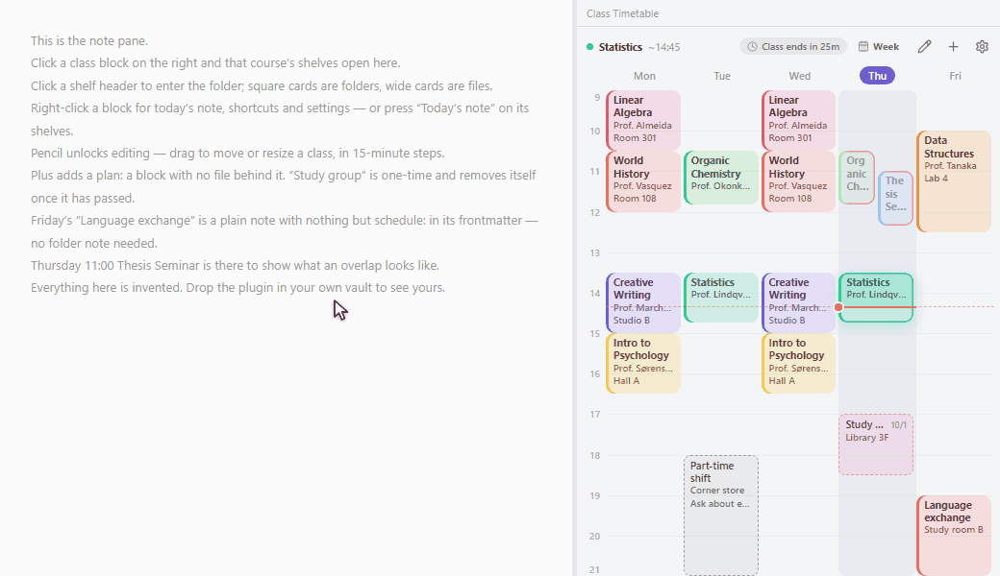

# Class Timetable

**A weekly class timetable and course schedule in the sidebar, on desktop and
mobile.** And a way into the notes behind each class.

Class times are stored in your notes' own frontmatter, not in plugin settings. Rename a folder, move a note, or edit the YAML by hand: the timetable follows. Nothing lives in a place Obsidian can't see.



### [▶ Try it in your browser — no install](https://elliott-json-park.github.io/obsidian-class-timetable/)

The real plugin, on a made-up timetable. Drag a class to move it, click one to
open its shelves, switch the language — it runs the same `main.js` the release
ships, not a mock-up of it. Nothing is uploaded and no network request is made.

Or install **Class Timetable** from Settings → Community plugins.

## What it does

**A timetable in the sidebar.** Real clock times on the vertical axis, not period numbers. Overlapping classes split the column instead of hiding each other. The current time is marked, and the top bar counts down to the end of the class you're in — or to whatever comes next. When the day is done it says so instead of counting.


**Click a class, get its shelves.** Obsidian can't "open a folder", so the plugin opens a view of one: the folders belonging to that class, laid out like a bookshelf. Square cards are folders, wide cards are files. Create, rename and delete them right there — names are typed in place, on the card itself.


**Start today's note in one step.** Right-click a class → *Create a note*, press *Today's note* on its shelves, or bind a hotkey to *Create today's note for the current class*. The file name and body come from a template you define (`{{course}}`, `{{date:MMDD}}`, `{{dow}}`, `{{week}}` …). If today's note already exists, it opens instead of being overwritten.

**See where you are in the day.** The class in progress is outlined and fills up as it goes; classes already over today step back. The shelves say whether you're in class now or when the next session is.

**Plans, without files.** Some things don't deserve a note — a shift, a study group, a dentist appointment. Add them straight onto the grid. A one-time plan carries the date it disappears on, and removes itself once that time has passed.

**Share your week as an image.** *Save as PNG* or *Copy image* from the gear, the view's ⋯ menu, or the command palette. The whole week is drawn at full size in your current theme — no cropping by a narrow sidebar, no scrolling — ready to send to a group chat. Saved images go to your attachments folder.

**One day at a time, when you want it.** Switch between the whole week and today alone.


**Four languages.** English, 한국어, 中文, 日本語 — picked from Obsidian's own language on first run, switchable at runtime, no restart. What gets written to your files never changes with the language: weekdays are always stored as `월 화 수 목 금 토 일`, only the display is translated.

## How a class is defined

Any note with a `schedule:` field becomes a class. That's the whole contract.

```yaml
---
schedule:
  - 월 10:30-12:00 @ Room 301
  - 수 10:30-12:00 @ Room 301
---
```

Everything else is optional:

| Key | What it does |
|---|---|
| `title` | Name shown on the block (defaults to the file or folder name) |
| `subtitle` | Small line under the name. Line breaks are kept |
| `notes` | Folder new notes are created in. Follows the folder if you move it |
| `shortcuts` | Files pinned to the top of the right-click menu |
| `color` | Block color. Omit it and one is picked from the palette |
| `semester` | Filter, so last term's classes can stay in the vault |

Times are read generously: `월`, `월요일`, `mon`, `m`, `月`, `一` all work, as do `9`, `9:00`, `09:00` and `0900`.

## Getting started

The timetable opens in the right sidebar the first time the plugin is enabled. After that, it's on the ribbon (calendar icon) and in the command palette.

**Just looking?** Press *Try a sample timetable* on the empty timetable (or run *Create a sample timetable*). Five made-up classes appear in a `Timetable sample` folder, with shelves to click through. *Remove the sample timetable* sends that one folder to the trash when you're done.

**Your own week:**

1. Press *Add a class*, or click the **pencil** to unlock editing and drag on an empty cell. Editing is locked by default so a stray click can't move your week.
2. Pick the note or folder the class belongs to. The times are written into that note's frontmatter.
3. Click a class block to open its shelves; right-click for today's note, shortcuts and settings.

In Settings you can point the plugin at one or more **course folders** so it only scans those, set the current semester, and edit templates. The **gear** in the timetable's top bar holds the display options: language and the hours the grid shows. The timetable follows Obsidian's light or dark theme.

## Commands

| Command | |
|---|---|
| Timetable | Open the timetable in the sidebar |
| Create today's note for the current class | The class in progress — or the nearest one today — gets today's note from your template |
| Open shelves of the current class | Same class, its shelves |
| Add class · Add plan | Open the editor directly |
| Save timetable as PNG · Copy timetable image | The whole week as an image, in your current theme |
| Create a sample timetable · Remove the sample timetable | Look around first, clean up in one step |

## Editing

| | |
|---|---|
| Left click | Open the class's shelves (`Ctrl`/`Cmd` for a new tab) |
| Right click | Menu — today's note, shelves, shortcuts, then editing the class |
| Pencil → drag | Move a class, or drag its edge to resize. 15-minute steps |
| Plus → drag | Add a plan on the grid, with no file behind it |

Finer times than 15 minutes are typed in by hand, on purpose — a shaky drag should not produce a class that starts at 11:47.

When a change would overlap another class or plan, a confirmation appears **before** anything is written, listing everything it collides with. Overlaps found while scanning (someone else's sync, hand-edited YAML) are only outlined in red — no dialog interrupts your typing.

Mouse, touch and pen are all handled, so editing works the same on a tablet.

## Install

**From the community plugin browser:** Settings → Community plugins → Browse →
"Class Timetable" → Install.

**Manually:** download `main.js`, `manifest.json` and `styles.css` from the
[latest release](https://github.com/elliott-json-park/obsidian-class-timetable/releases/latest),
put them in `<your vault>/.obsidian/plugins/class-timetable/`, then reload
Obsidian and enable **Class Timetable** in *Settings → Community plugins*.

Desktop and mobile both. The timetable is the same on a phone; editing is
handled for touch and pen as well as the mouse.

## Notes on data

Classes live in your notes. Plans live in the plugin's `data.json`, since they have no file of their own — which also means they don't sync between devices the way your notes do.

Nothing is ever deleted without asking. *Remove from timetable* clears only the `schedule:` field; the note and its folder stay.

The plugin makes no network requests and collects nothing.

## 한국어

수업 시간표를 옵시디언 사이드바에 상시 띄워 두고, 블록을 누르면 그 수업의 폴더들이 책장처럼 펼쳐집니다. 시간 정보는 플러그인 설정이 아니라 **노트의 frontmatter**에 저장되므로 폴더를 옮기거나 이름을 바꿔도 깨지지 않습니다.

`schedule:` 한 줄만 있으면 어떤 노트든 수업이 됩니다. 폴더노트 구조를 쓰지 않아도 되고, 메모 한 장으로 쓰셔도 됩니다.

```yaml
---
schedule:
  - 월 10:30-12:00 @ 301호
---
```

처음 켜면 시간표가 오른쪽 사이드바에 열립니다. 먼저 둘러보고 싶다면 빈 시간표의 **예시 시간표 불러오기**를 누르세요. 다섯 과목짜리 예시가 `시간표 예시` 폴더에 만들어지고, 다 보면 **예시 시간표 지우기** 명령으로 한 번에 치울 수 있습니다.

수업 중에는 **지금 수업의 오늘 노트 만들기** 명령(단축키 지정 가능)이나 책장의 **＋ 오늘 노트** 버튼으로 템플릿에 맞춘 필기 노트를 바로 엽니다.

톱니 → **PNG로 저장 / 이미지 복사**로 한 주 전체를 지금 테마 색 그대로 그림으로 뽑을 수 있습니다. 사이드바가 좁아도 잘리지 않고, 저장한 그림은 첨부 파일 폴더에 들어갑니다.

화면 언어는 처음에 옵시디언 언어를 따라 정해지고, 환경설정(톱니)에서 한국어·English·中文·日本語 중에 바꾸실 수 있습니다. 파일에 저장되는 요일 표기는 언어와 무관하게 항상 `월 화 수 목 금 토 일`입니다.

## License

MIT
