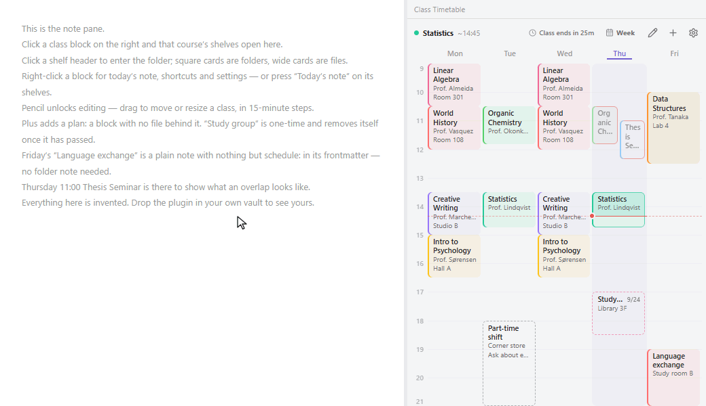
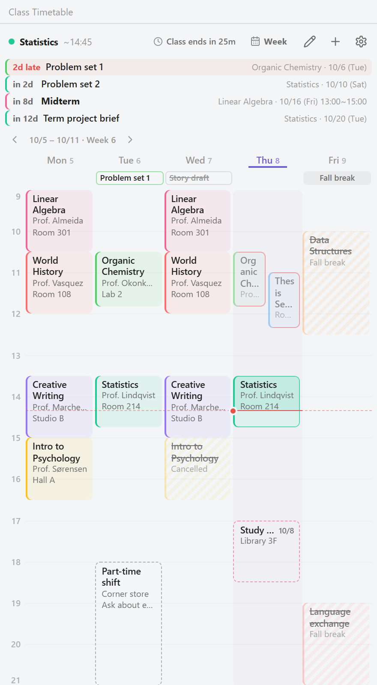
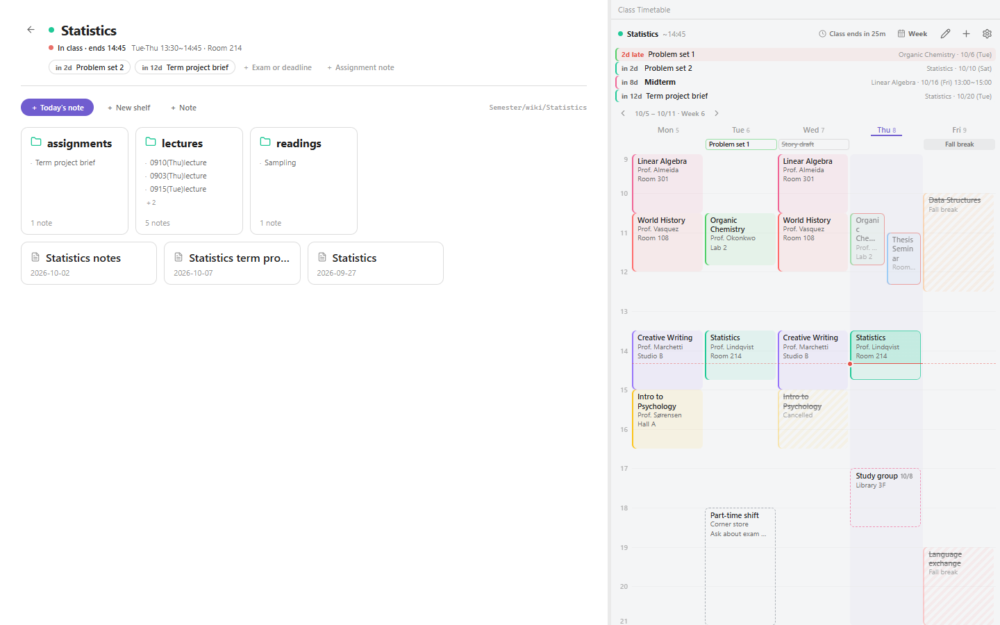
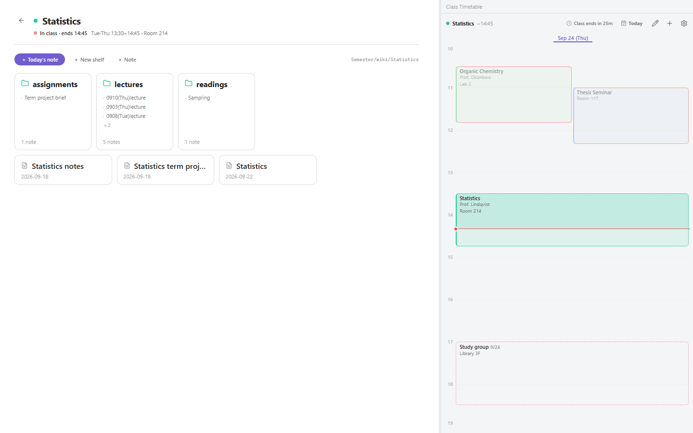

# Class Timetable

**A weekly class timetable and course schedule in the sidebar, on desktop and
mobile.** And a way into the notes behind each class.

Class times are stored in your notes' own frontmatter, not in plugin settings. Rename a folder, move a note, or edit the YAML by hand: the timetable follows. Nothing lives in a place Obsidian can't see.



### [▶ Try it in your browser — no install](https://elliott-json-park.github.io/obsidian-class-timetable/)

The real plugin, on a made-up timetable. Drag a class to move it, click one to
open its shelves, switch the language — it runs the same `main.js` the release
ships, not a mock-up of it. Nothing is uploaded and no network request is made.

Or install **Class Timetable** from Settings → Community plugins.

## What it does

**A timetable in the sidebar.** Real clock times on the vertical axis, not period numbers. Overlapping classes split the column instead of hiding each other. The current time is marked, and the top bar counts down to the end of the class you're in — or to whatever comes next. When the day is done it says so instead of counting.



**Click a class, get its shelves.** Obsidian can't "open a folder", so the plugin opens a view of one: the folders belonging to that class, laid out like a bookshelf. Square cards are folders, wide cards are files. Create, rename and delete them right there — names are typed in place, on the card itself.



**Start today's note in one step.** Right-click a class → *Open today's note*, press *Today's note* on its shelves, or bind a hotkey to *Create today's note for the current class*. The file name and body come from a template you define (`{{course}}`, `{{date:MMDD}}`, `{{dow}}`, `{{week}}` …). If today's note already exists, it opens instead of being overwritten. Right-click a class on another day and the menu names that day instead — *Open the note for 10/5 (Mon)* — and that is the date the note gets.

**Every week is not the same week.** The arrows above the grid step through weeks; the label shows the dates and, once you set a semester start, the week number. Right-click a class to mark that one day as **cancelled** — it stays in place, struck through, and stops counting as your next class. A class that only meets every other week takes `odd` or `even`. Set a **semester end** and the classes stop being drawn after it. List **days without classes** — holidays, exam weeks, reading weeks — and every class on those days is struck through at once, with the day's name above it.

**Exams and deadlines, where you will see them.** Write them under `exam:` and `due:` in the class note, or give each assignment a note of its own with *New assignment note*. They sit under the day they fall on, and the next ones are listed above the grid with the days left. A deadline you missed does not quietly disappear: it stays at the top in red — *2d late* — until you mark it done. Done items keep their record, struck through on their day. Click one to open its note.

**The timetable inside a note.** A `class-timetable` code block draws the same week in a daily note or a dashboard — or just the list of what is coming up.

**See where you are in the day.** The class in progress is outlined and fills up as it goes; classes already over today step back. The shelves say whether you're in class now or when the next session is.

**Plans, without files.** Some things don't deserve a note — a shift, a study group, a dentist appointment. Add them straight onto the grid. A one-time plan carries the date it disappears on, and removes itself once that time has passed.

**Share your week as an image.** *Save as PNG* or *Copy image* from the gear, the view's ⋯ menu, or the command palette. The whole week is drawn at full size in your current theme — no cropping by a narrow sidebar, no scrolling — ready to send to a group chat. Saved images go to your attachments folder.

**One day at a time, when you want it.** Switch between the whole week and today alone.



**Four languages.** English, 한국어, 中文, 日本語 — picked from Obsidian's own language on first run, switchable at runtime, no restart. What gets written to your files never changes with the language: weekdays are always stored as `월 화 수 목 금 토 일`, only the display is translated.

## How a class is defined

Any note with a `schedule:` field becomes a class. That's the whole contract.

```yaml
---
schedule:
  - 월 10:30-12:00 @ Room 301
  - 수 10:30-12:00 @ Room 301
---
```

Everything else is optional:

| Key | What it does |
|---|---|
| `title` | Name shown on the block (defaults to the file or folder name) |
| `subtitle` | Small line under the name. Line breaks are kept |
| `notes` | Folder new notes are created in. Follows the folder if you move it |
| `shortcuts` | Files pinned to the top of the right-click menu |
| `color` | Block color. Omit it and one is picked from the palette |
| `semester` | Filter, so last term's classes can stay in the vault |
| `exam` | Exams, one per line: `2026-10-22 13:00-15:00 Midterm` |
| `due` | Assignment deadlines, one per line: `2026-10-15 Problem set 1`. A `✓` at the end marks it done |
| `cancelled` | Dates this class does not meet: `2026-10-05` |

Times are read generously: `월`, `월요일`, `mon`, `m`, `月`, `一` all work, as do `9`, `9:00`, `09:00` and `0900`.

## Biweekly classes, cancelled days, exams and deadlines

```yaml
---
schedule:
  - mon 10:30-12:00 @ Room 301
  - wed 10:30-12:00 odd @ Lab 2     # odd weeks only; `even` for the others
exam:
  - 2026-10-22 13:00-15:00 Midterm
due:
  - 2026-10-08 Reading response ✓  # done
  - 2026-10-15 Problem set 1
cancelled:
  - 2026-10-05
---
```

You rarely type any of this. *Edit class* has an every week / odd weeks / even weeks choice per time, the right-click menu has *Mark 10/5 (Mon) as cancelled* and *Add an exam or deadline…*, and right-clicking a deadline has *Mark as done*.

- **Odd and even weeks** are counted from the *Semester start* in Settings — that week is week 1. The edit window tells you which kind this week is, so you do not pick the wrong one.
- **A date is enough** for an exam or a deadline. A time (`13:00` or `13:00-15:00`) and a name are read if they are there.
- **Done is a mark, not a deletion.** *Mark as done* adds a `✓` to the end of the line (or `done: true` to an assignment note). The item leaves the upcoming list and stays on its day, struck through. *Mark as not done* takes it back.
- **Missed deadlines stay.** An unfinished deadline that has passed is listed first, in red, until you mark it done — for up to 30 days, so last term's leftovers do not pile up. Exams leave the list once their day is over.
- **An assignment note can carry its own deadline.** A note with `due: 2026-10-15` in its frontmatter, anywhere inside a course's folder, shows up as that course's deadline under the note's name. If the course is a plain note rather than a folder note, name the course in the assignment: `course: Linear Algebra`.
- **New assignment note** (on a course's shelves, in the command palette, or as a checkbox in *Add an exam or deadline…*) writes that note for you: named after the assignment, with `due:` and a `course:` link filled in. It goes into the course's assignments folder if it has one (`assignments`, `homework`, `과제`, `作业`, `課題` …), otherwise into the course folder. No folder is ever created for you.
- **Upcoming** lists the next 14 days above the grid. The gear changes that to 7 or 30 days, or hides it.

## Days without classes

Settings → *Days without classes*, one per line — a date or a range, with an optional name:

```
2026-11-26 Thanksgiving
2026-10-19 ~ 2026-10-23 Reading week
```

Every class on those days is drawn struck through, the name sits above the day, and *next class* and *today's note* skip them. Nothing is written to your class notes. To cancel just one class on one day, right-click it instead.

## The timetable inside a note

````markdown
```class-timetable
```
````

An empty block draws this week. It is the same timetable as the sidebar, read-only: step through weeks, click a class for its shelves, click a deadline for its note. Options go inside the block, one per line:

| Option | |
|---|---|
| `view: week` | The week (default). `today` for one day, `upcoming` for just the list of exams and deadlines |
| `height: 420` | Height of the block in pixels |
| `days: 30` | With `view: upcoming`, how far ahead to look |
| `upcoming: false` | Leave the list of exams and deadlines out of the week view |

*Insert timetable into note* and *Insert upcoming exams and deadlines into note* in the command palette write the block for you.

## Getting started

The timetable opens in the right sidebar the first time the plugin is enabled. After that, it's on the ribbon (calendar icon) and in the command palette.

**Just looking?** Press *Try a sample timetable* on the empty timetable (or run *Create a sample timetable*). Five made-up classes appear in a `Timetable sample` folder, with shelves to click through. *Remove the sample timetable* sends that one folder to the trash when you're done.

**Your own week:**

1. Press *Add a class*, or click the **pencil** to unlock editing and drag on an empty cell. Editing is locked by default so a stray click can't move your week.
2. Pick the note or folder the class belongs to. The times are written into that note's frontmatter.
3. Click a class block to open its shelves; right-click for today's note, shortcuts and settings.

In Settings you can point the plugin at one or more **course folders** so it only scans those, set the current semester with its start and end dates, and edit templates. The **gear** in the timetable's top bar holds the display options: language and the hours the grid shows. The timetable follows Obsidian's light or dark theme.

## Commands

| Command | |
|---|---|
| Timetable | Open the timetable in the sidebar |
| Create today's note for the current class | The class in progress — or the nearest one today — gets today's note from your template |
| Open shelves of the current class | Same class, its shelves |
| Add class · Add plan | Open the editor directly |
| Next week · Previous week · This week | Step the timetable through weeks |
| Add an exam or deadline | For the class in progress, or any class you pick |
| New assignment note | A note for one assignment, with its `due:` date and course filled in |
| Insert timetable into note · Insert upcoming exams and deadlines into note | Write the code block at the cursor |
| Save timetable as PNG · Copy timetable image | The whole week as an image, in your current theme |
| Create a sample timetable · Remove the sample timetable | Look around first, clean up in one step |

## Editing

| | |
|---|---|
| Left click | Open the class's shelves (`Ctrl`/`Cmd` for a new tab) |
| Right click | Menu — today's note, shelves, cancelling that day, exams and deadlines, shortcuts, then editing the class |
| Pencil → drag | Move a class, or drag its edge to resize. 15-minute steps |
| Plus → drag | Add a plan on the grid, with no file behind it |

Finer times than 15 minutes are typed in by hand, on purpose — a shaky drag should not produce a class that starts at 11:47.

Dragging a class changes its weekly time, whichever week you are looking at. A one-time plan belongs to the week you drew it in.

When a change would overlap another class or plan, a confirmation appears **before** anything is written, listing everything it collides with. An odd-week class and an even-week class at the same hour do not collide. Overlaps found while scanning (someone else's sync, hand-edited YAML) are only outlined in red — no dialog interrupts your typing.

Mouse, touch and pen are all handled, so editing works the same on a tablet.

## Install

**From the community plugin browser:** Settings → Community plugins → Browse →
"Class Timetable" → Install.

**Manually:** download `main.js`, `manifest.json` and `styles.css` from the
[latest release](https://github.com/elliott-json-park/obsidian-class-timetable/releases/latest),
put them in `<your vault>/.obsidian/plugins/class-timetable/`, then reload
Obsidian and enable **Class Timetable** in *Settings → Community plugins*.

Desktop and mobile both. The timetable is the same on a phone; editing is
handled for touch and pen as well as the mouse.

## Notes on data

Classes live in your notes — and so do their exams, deadlines and cancelled days. Plans and days without classes live in the plugin's `data.json`, since they have no file of their own — which also means they don't sync between devices the way your notes do.

Nothing is ever deleted without asking. *Remove from timetable* clears only the `schedule:` field; the note and its folder stay.

The plugin makes no network requests and collects nothing. It only writes to the clipboard when you press *Copy image*, and never reads from it.

## Feedback

Something broken, or something your semester needs that is not here? [Report a bug](https://github.com/elliott-json-park/obsidian-class-timetable/issues/new?template=bug_report.yml) or [suggest a feature](https://github.com/elliott-json-park/obsidian-class-timetable/issues/new?template=feature_request.yml) — the same two links are at the bottom of the plugin's settings. Questions and setups go in [Discussions](https://github.com/elliott-json-park/obsidian-class-timetable/discussions). 한국어로 적으셔도 됩니다.

## 한국어

수업 시간표를 옵시디언 사이드바에 상시 띄워 두고, 블록을 누르면 그 수업의 폴더들이 책장처럼 펼쳐집니다. 시간 정보는 플러그인 설정이 아니라 **노트의 frontmatter**에 저장되므로 폴더를 옮기거나 이름을 바꿔도 깨지지 않습니다.

`schedule:` 한 줄만 있으면 어떤 노트든 수업이 됩니다. 폴더노트 구조를 쓰지 않아도 되고, 메모 한 장으로 쓰셔도 됩니다.

```yaml
---
schedule:
  - 월 10:30-12:00 @ 301호
---
```

처음 켜면 시간표가 오른쪽 사이드바에 열립니다. 먼저 둘러보고 싶다면 빈 시간표의 **예시 시간표 불러오기**를 누르세요. 다섯 과목짜리 예시가 `시간표 예시` 폴더에 만들어지고, 다 보면 **예시 시간표 지우기** 명령으로 한 번에 치울 수 있습니다.

수업 중에는 **지금 수업의 오늘 노트 만들기** 명령(단축키 지정 가능)이나 책장의 **＋ 오늘 노트** 버튼으로 템플릿에 맞춘 필기 노트를 바로 엽니다.

격자 위의 화살표로 **지난주·다음 주**를 넘겨 볼 수 있습니다. 수업을 우클릭하면 **그 날 하루만 휴강**으로 표시할 수 있고, 격주 수업은 시간 뒤에 `odd`(홀수 주)·`even`(짝수 주)을 붙입니다. 설정에 **학기 시작일·종료일**을 적으면 주차가 표시되고, 종료일 뒤에는 수업을 그리지 않습니다.

**시험과 과제 마감**은 수업 노트의 `exam:` · `due:` 에 한 줄씩 적습니다(우클릭 → **시험·마감 추가…** 로도 됩니다). 그 날짜의 요일 아래에 뜨고, 가까운 것은 시간표 위에 D-day 와 함께 나옵니다. 과제 노트에 `due: 2026-10-15` 만 적어도, 그 노트가 수업 폴더 안에 있으면 마감으로 잡힙니다.

```yaml
---
schedule:
  - 월 10:30-12:00 @ 301호
  - 수 10:30-12:00 odd @ 301호
exam:
  - 2026-10-22 13:00 중간고사
due:
  - 2026-10-15 과제 1
cancelled:
  - 2026-10-05
---
```

끝낸 마감은 우클릭 → **완료로 표시**를 누르면 줄 끝에 `✓`가 붙고(과제 노트라면 `done: true`), 다가오는 목록에서 빠진 채 그 날짜 칸에 줄 그은 채로 남습니다. **완료로 표시하지 않은 마감은 날짜가 지나도 사라지지 않고** "2일 지남"으로 목록 맨 위에 빨갛게 남습니다(최대 30일). 과제를 노트 한 장으로 관리하고 싶다면 수업 책장의 **＋ 과제 노트**나 **새 과제 노트** 명령을 쓰세요. 과제 이름으로 노트를 만들고 `due:` 와 `course:` 를 채워 줍니다. 수업 폴더 안에 `과제`·`assignments` 같은 폴더가 있으면 그 안에 만듭니다.

공휴일·시험 주간처럼 **모든 수업이 쉬는 날**은 설정의 **수업 없는 날**에 한 줄씩 적습니다(`2026-10-09 한글날`, `2026-10-20 ~ 2026-10-24 중간고사 주간`). 그 날의 수업은 한꺼번에 줄이 그어지고, 요일 위에 이름이 뜹니다. 수업 노트에는 아무것도 쓰지 않습니다.

노트 안에 시간표를 넣으려면 `class-timetable` 코드블록을 씁니다. 빈 블록이면 이번 주가 나오고, `view: today` · `view: upcoming` · `height: 420` 같은 옵션을 한 줄씩 적을 수 있습니다.

버그나 필요한 기능은 설정 맨 아래 **의견 보내기**로 알려 주세요.

톱니 → **PNG로 저장 / 이미지 복사**로 한 주 전체를 지금 테마 색 그대로 그림으로 뽑을 수 있습니다. 사이드바가 좁아도 잘리지 않고, 저장한 그림은 첨부 파일 폴더에 들어갑니다.

화면 언어는 처음에 옵시디언 언어를 따라 정해지고, 환경설정(톱니)에서 한국어·English·中文·日本語 중에 바꾸실 수 있습니다. 파일에 저장되는 요일 표기는 언어와 무관하게 항상 `월 화 수 목 금 토 일`입니다.

## License

MIT
